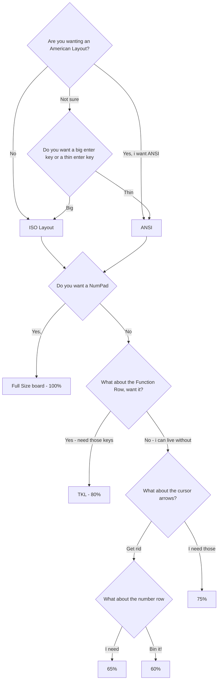

+++
date = "2016-11-05T19:41:01+05:30"
title = "The decision tree"
draft = false
showonlyimage = false
weight = 1
+++

Choosing your first mechanical keyboard can be tricky. ISO or ANSI, RED or BROWN, 60% or TKL.
Skip the n00b mistakes and ride the decision tree here.
<!--more-->

## Keyboard decision tree

Not as simple as buying one on features, brand or style - there's quite the series of decisions to make that will narrow the selection dramatically.

There's so many different options, brands and standards with keyboards that having a structured approach to decisions is glossed over. The order in which you make these decisions and stick to them will really help you navigate the plethora of options.

### Layout : ANSI or ISO

The first thing i didn't appreciate was ANSI (American) or ISO (International) layout.

It should be the **first** decision to make, because you'll either choose what you're used to (based on which country you're from), or you'll switch to ANSI in order to fit in with the American customising community (not as many keycap sets are available in ISO). Lots of gamers tend to go for ANSI keyboards, and most seem to prefer the ANSI layout (or just accept it).

ISO boards have an extra key (and therefore switch) between the left shift and the z key, whereas ANSI just have a big left shift. This means there's 105 keys on a full ISO board and 104 keys on an ANSI.

> It's the first decision you should make because once you have a board of either origin, you're locked in. No switching without changing the board.

I opted for ISO, like any good middle aged brit would... I'm not changing now 😄.

### Form Factor

This is the next decision point. How compact do you want your board, on a scale from 100% to 60% (not smaller keys, but less keys).

| Style | What it means |
| ----- | ------------- |
| Full size | Big keyboard with num pad |
| TKL / 80% | No  Num Pad |
| 75% | Cursor keys are still dedicated but integrated with the rest of the keys more |
| 65% | Function key row has been removed
| 60% | Cursor keys have been removed

I'm quite used to the full size keyboards, but i rarely use the num pad. I didn't on the other hand want to lose the spacing between the main keys and the cursor - so i went TKL, the 80% board.

### Switches

Deciding what colour switches is the next thing.

- Red = Linear
- Blue = Loud clicks
- Brown = Tactile (a bump can be felt)

This colour - behaviour pattern is the same regardless of the switch manufacturer.

Red seems to be the more usual route for newbies and gamers alike. If you're not sure then know you can change the switches more easily if you buy a hot swappable board. You can buy [small switch testing boards](https://www.amazon.co.uk/Mechanical-Keyboards-Testing-Retooled-Sampler/dp/B08JPK8SBM) equipped with all possible colour switches to help expedite this process.

I went for the Red switches, but have bought browns and blues which i'll fit in due course.

### Hot swap not?

If you want to avoid going too deep into the rabbit hole, i'd suggest you can exit the decision tree here and buy a board that doesn't have hot swappable switches. [Corsair](https://www.corsair.com/uk/en/Categories/Products/Gaming-Keyboards/c/Cor_Products_Keyboards), [Razer](https://www.razer.com/gb-en/pc/gaming-keyboards-and-keypads) and the usual gaming suspects make a few different boards that seem to be popular.

Careful though, the cheaper Outemu keyboards will label themselves as hot-swappable but it's only with the other Outemu switches. You won't be able to use the other brands of switch, **locking yourself in to Outemu**. Some people have modded there way around this by compressing each of the switch pins to fit the board (eww). These boards are cheap enough to be a workable first board, but i'd unknowingly jumped this step.

The cheaper Outemo hot-swap boards are [Redragon](https://www.amazon.co.uk/Redragon-Mechanical-Keyboard-Illuminated-UK-Layout-Single-Colour/dp/B07CMGWKMT) and [Tecware Phantom](https://www.amazon.co.uk/Phantom-88-Key-Backlit-Mechanical-Keyboard-UK-88-RED).

For me, tinkering is inevitable so i went for the Hot Swap option on the Keychron K8 which comes with the Gateron switches, and i can easily switch to the Cherry brand MX switches (and compatibles) if i want to.

## Key caps

If you've gone down the ANSI route, you'll have lots of options available. ISO, not so much. If you are going ISO, check the images of keycap sets you're looking at to make sure the "big enter key" is included.

The keycap sets that take my eye are made by these 3; [GMK](https://kbdfans.com/collections/gmk-keycaps), [Epomaker](https://epomaker.com/collections/keycaps) and [Akko](https://en.akkogear.com/store/keycap/).

Almost all the keycaps are for Cherry MX style switches, so there's no other compatibility problems you should have unless you bought a weird proprietary board.

### Shine through

Keycaps will generally allow lighting on the board to shine through. Some cheaper keycaps don't, so if you're a fan of keyboard lighting then you'll need to make sure any new keycaps allow shine through.

### Profile

There are a number of different profile keycaps which come down to preference.

The Keychron K8 uses the OEM profile with an MX style.

The [MA profile](https://drop.com/buy/idobao-ma-blue-cat-pbt-dye-subbed-keycap-set) looks interesting, and keycaps are relatively cheap so it's likely I'll purchase a few sets.

### Locale and special branded keys

Often you'll need to check the keycap sets include the right extra keys for your locale. For the UK it's usually labelled as "ISO - UK", and will include the 6 special iso keys.

Some keyboard sets will also include other special keys with neat glyphs on them, or charge extra for an additional few of these keycaps.

### Space bar sizes

The most common spacebar size seems to 6.25u, with some of the smallest 60% keyboards sporting a 4u space bar which looks ridiculous. Most of the Corsair models have a 6.5u size, so caution should be exercised when buying one of their keycap sets.

### Group buys

It seems to be the community vibe for group-buys to provide limited runs of keycaps. They're set up for a specific design, profile and colour. These group buys can take up to a year from commitment to delivery and can cost as much as the keyboard itself for a good quality set.

The UK site is [https://prototypist.net/collections/live-group-buys](https://prototypist.net/collections/live-group-buys).

### Clones

Some of the popular keycap sets like [Milk & Honey](https://epomaker.com/products/epomaker-honey-and-milk-keycaps-set) and [Red Samurai](https://drop.com/buy/drop-redsuns-gmk-red-samurai-keycap-set) have cheaper clones of the same designs available on your favourite tech eShops like Amazon and AliExpress. Often the clone sets won't feature the same novelty keys as the original designer and may not be **shine through**.

## Features

To a certain extend i think the actual features of the keyboard matter a lot less.

### Lighting

Gamers seem to like RGB lights, so if the keyboard exploding with colour whenever you tap a key is your thing - you'll want a board with RGB colours and  maybe even QMK/VIA support for customising the effects for different keys.

Most keyboards have north facing switches which provide light directly under the key legend on the keycap. Some keyboards have south facing switches which won't allow as much light through but have [other benefits](https://keyboardable.com/north-facing-switches-vs-south-facing-switches/).

### Bluetooth

Having bluetooth as an option seems popular, but unless you're packing it away regularly i don't think bluetooth adds a lot. Bluetooth keyboards often don't wake up the laptop.

## Modding

### Foam

Some cases can be quite hollow, and the sound will improve if foam is added to the case. Silicon pours are becoming popular, as they provide more **heft** than foam.

### Lubing

Disassembling switches and lubing seems to be the done thing to reduce a scratchy feeling when pressing the keys.

## That decision tree again

So here's where i ended up. I think i was lucky in picking a good base 😉

> ISO > TKL > Red switches > Hot-swap > OEM and MA keycaps with UK ISO keys

## Decision tree - mermaid

